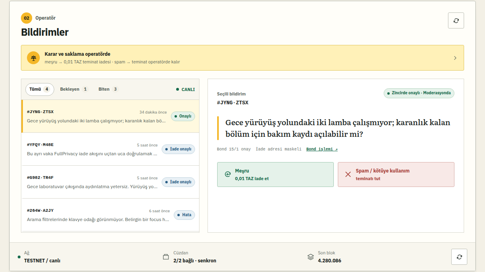

# HushBoard

[](https://github.com/apo110-dev/HushBoard/actions/workflows/ci.yml)

> **Hesap açmadan geri bildirim; 0,01 TAZ iade edilebilir testnet teminatıyla.**

HushBoard, isim/e-posta istemeyen bir geri bildirim panosudur. Gönderen kişi `0,01 TAZ`
(parasal değeri olmayan Zcash testnet parası) tutarında **shielded teminat** yollar.
Moderatör bildirimi meşru işaretlerse `0,01 TAZ` teminat anaparası ayrı bir shielded
işlemle iade edilir; gönderim ağ ücreti iade edilmez. Spam için teminat iade edilmez.

Bu depozito **merkezî ve custodial** bir MVP politikasıdır. Smart contract, trustless
escrow veya mutlak anonimlik iddiası yoktur.



> [!WARNING]
> Yalnız Zcash **testnet** içindir. Gerçek ZEC, production custody veya gerçek kullanıcı
> verisiyle kullanmayın.

## Hızlı deneme — wallet ve Docker gerektirmez

Linux, Python `>=3.11,<3.14`, [`uv`](https://docs.astral.sh/uv/), Git ve `curl` ile:

```bash
git clone https://github.com/apo110-dev/HushBoard.git
cd HushBoard
HUSHBOARD_MODE=mock ./START_DEMO.sh
```

Bu yol checked-in, sanitize edilmiş snapshot'ın disposable bir SQLite kopyasını açar;
wallet RPC çağırmaz, testnet işlemi yayınlamaz ve tüm mutation kontrollerini kapatır.
Tarayıcı açılmazsa `http://127.0.0.1:4173` adresine gidin.

## Demoda gösterilen gerçek parçalar

- Yerel **Zebra** full node ile Zcash testnet doğrulaması
- Birbirinden izole **participant** ve **operator** Zallet cüzdanları
- Her başvuru için yeni Orchard-only Unified Address (NU6.3 sonrasında bu receiver'a gelen not Zallet'te `ironwood` pool olarak görünür; `ironwood` ayrı bir UA receiver tipi değildir)
- Tam `1,000,000 zatoshi` + `HB1:<id>` memo içeren ZIP-321 ödeme isteği ve QR
- Zallet'ten gelen amount / memo / receiver / confirmation eşleştirmesi
- Kalıcı SQLite state machine ve idempotent payment/refund kayıtları
- Gerçek `z_sendmany` bond ve refund broadcast'leri

## Sunum laptopunda tek komut

Hazırlanmış ve senkron laptopta:

```bash
cd HushBoard
./START_DEMO.sh
```

Tarayıcı `http://127.0.0.1:4173` adresinde sade katılımcı akışıyla açılır.
Operatör paneli sağ üst bağlantıda veya doğrudan
`http://127.0.0.1:4173/#console` adresindedir. Durdurmak için `Ctrl+C`.

5 slaytlık sunum: `http://127.0.0.1:4173/static/deck.html`.
45 saniyelik hibrit video kaynakları: [`VIDEO_SUNUM.md`](VIDEO_SUNUM.md). Sessiz Kling B-roll, deterministik evidence ve ayrı Türkçe voice için yeniden üretim paketi: [`VIDEO_PAKETI/`](VIDEO_PAKETI/README.md). Generated final video Git'e dahil değildir.
Wallet servislerini de durdurmak isterseniz `./STOP_WALLETS.sh`; Zebra'yı senkron
kalması için özellikle durdurmaz.

Pinned Zallet Docker imajı `linux/amd64` içindir ve Rust gerektirmez. Zallet'i kaynak koddan
derlemek isterseniz önce ayrı upstream checkout'a geçin:

```bash
git clone --branch v0.1.0-beta.2 --depth 1 https://github.com/zcash/zallet.git
cd zallet
rustup toolchain install 1.91 --component rustfmt
cargo +1.91 build --release
```

### Sahne öncesi zorunlu kontrol

```bash
./scripts/preflight.sh
```

Public varsayılanda gerçek gönderimler kapalıdır. Yalnız wallet'lar fonlandıktan ve preflight
başarılı olduktan sonra prova için açıkça etkinleştirin:

```bash
HUSHBOARD_ENABLE_LIVE_SENDS=1 ./START_DEMO.sh
```

Startup, yeniden yaratılmış Zallet container'larının tip'e yetişmesi için dört dakikaya kadar
bekler. Preflight her iki wallet'ın tip ile eşit, node'un hazır ve en azından bond+fee için
spendable bakiyelerin yeterli olduğunu doğrular. **Cold setup tek komut vaadine dahil değildir:**
yeni Zebra testnet senkronu saatler sürebilir. İlk kurulum en az bir gün önce yapılır:

```bash
./scripts/bootstrap-testnet-wallets.sh
```

Gereksinimler: `linux/amd64`, Git, Docker + Compose 2.24.6+, `curl`, Python
`>=3.11,<3.14` ve `uv`. Zallet RPC'leri
(`41232`, `41233`), Zebra RPC/health (`18232`, `18080`) ve web app yalnız loopback'e
bind edilir; yalnız Zebra P2P `18233` testnet peer'ları için public kalır. Wallet cookie ve
seed verileri `.runtime/` ve Docker volume'larında kalır. Z3 checkout ve Zebra image digest'i
cold setup için pinlidir.

## 75 saniyelik golden path

1. Varsayılan katılımcı ekranında sade mesaj → teminat akışını ve üstte
   `GERÇEK TESTNET · CANLI` rozetini göster.
2. Sağ üstten **Operatör paneline** geç ve “Gece yürüyüş yolundaki iki lamba
   çalışmıyor” başvurusunu aç.
3. Yalnız `python3 scripts/verify-stage-fixture.py` başarılıysa bunun **sahne öncesinde
   onaylanmış gerçek testnet bond'u** olduğunu söyle; canlı confirmation bekliyormuş gibi yapma.
4. Ekrandaki güncel `Bond n/1 onay` sayacını göster. Tam `1,000,000 zat`,
   `HB1:<id>`, receiver ve mined-height eşleşmesini sahne öncesi verifier'ın kontrol
   ettiğini söyle; explorer'ın yalnız zincire dahil edilmeyi gösterdiğini açıkla.
5. **Meşru · 0,01 TAZ iade et** kararını ver ve açılan gerçek-send onayını yalnız
   sahnede bir kez kabul et.
6. Txid yokken yalnız “Zallet iadeyi hazırlıyor, henüz yayınlanmadı” de. Gerçek txid
   geldikten sonra “testnete yayınlandı, onay bekliyor” de. Yeni blok gelmediyse asla
   “onaylandı/iade edildi” deme.
7. Politika penceresinde **Karar ve saklama bizde** ve **Tam anonimlik yok** sınırlarını göster.

Yeni bond broadcast'i Q&A için bonus akıştır; ana demo testnet blok süresine bağlı değildir.
Ezber metni [`SUNUM.md`](SUNUM.md), ayrıntılı prova listesi
[`docs/DEMO_RUNBOOK.md`](docs/DEMO_RUNBOOK.md) içindedir.

## Kanıt manifesti

- Gerçek wallet funding tx: `9bd12efa4edd04187ffc8d8f37bc82886a558ff35590eb6e8da3f2bd72a8e524` — testnet height `4278614`'te mined.
  Bu `0.035 TAZ` output **bond diye sunulmaz**; iki izole wallet'ın fonlandığı altyapı
  kanıtıdır.
- Immutable replay manifesti: `fixtures/offline-replay.json`. Bu dosya belirli bir andaki
  tarihsel capture'dır; güncel sahne yetkisi değildir. O capture içindeki gerçek `0,01 TAZ + HB1` bond ve ayrı FullPrivacy refund vakası mined olarak sınıflandırılır. Metinler sahne için
  üretilmiş demo içeriğidir; gerçek invoice/refund adresleri ve wallet operation kimlikleri
  çıkarılmıştır. Adverse-path sentetik satırı `evidence_kind` ile ayrılır.
- Sanitize edilmiş txid/height/receipt özeti: [`docs/REAL_TESTNET_EVIDENCE.md`](docs/REAL_TESTNET_EVIDENCE.md).
- Sunumun live confirmed bond'u `.runtime/stage-fixture.json` içinden doğrulanır; bu dosya
  yalnız gerçek transaction mined olduğunda hazırlanır ve Git'e girmez.

## Mimari

```text
Browser (127.0.0.1:4173)
        │ JSON
        ▼
FastAPI ───── SQLite (workflow + idempotency)
   │                    chain'in kaynağı değildir
   ├─ operator Zallet :41232 ─┐
   └─ participant Zallet :41233 ─ Zaino library ─ Zebra full node ─ Zcash testnet
```

Zallet `v0.1.0-beta.2` prototip yazılımdır. Bu proje yalnız küçük, değersiz TAZ ile
hackathon/testnet demosudur; production veya gerçek fon için değildir.

## State machine

```text
awaiting_bond → bond_pending → moderation
                                  ├─ decision=refund + operation (durum hâlâ moderation)
                                  │       └─ txid kanıtı → refund_broadcast → refunded
                                  └─ kept
                 └─ mismatch / failure
```

- `bond_pending`: işlem görüldü ama confirmation eşiği gelmedi.
- `moderation`: receiver, integer amount ve memo tam eşleşti; yeterli confirmation var.
- `refund_broadcast`: Zallet operation success gerçek txid döndürdü.
- `refunded`: refund zincirde confirmation eşiğine ulaştı.
- `kept`: “yakıldı” değil; operatör cüzdanında iade edilmeden tutuldu.

## Offline replay (fail-closed fallback)

Wallet/node hazır değilse başarı taklit edilmez. `auto` modu wallet kaybında live kalır ve
fail-closed health verir; mutable simülasyona sessizce dönmez:

```bash
HUSHBOARD_MODE=mock ./START_DEMO.sh
# eşdeğer otomatik fallback:
HUSHBOARD_ALLOW_DEGRADED=1 ./START_DEMO.sh
```

`fixtures/offline-replay.json` Git'te duran immutable, zaman/height damgalı kaynak
snapshot'tır. Startup bunu yalnız `data/offline-replay.db` adlı **ayrı ve disposable**
SQLite kopyasına yükler; live DB'yi kullanmaz, wallet RPC çağırmaz ve explorer linki
üretmez. Üst rozet `OFFLINE REPLAY · NO LIVE SENDS`, alt durum satırı snapshot saati,
height ve `send kapalı` bilgisini gösterir.

Snapshot manifesti gerçek confirmed altyapı, confirmed bond ve confirmed refund
kanıtlarını sentetik mismatch satırından açıkça ayırır. Immutable snapshot'ta ödeme, moderasyon, iade ve reset kontrolleri kapalıdır; kaynak
manifest ve live DB değişmez.

## Manuel wallet kontrolleri

```bash
./scripts/wallet-rpc.sh operator getwalletstatus '[]'
./scripts/wallet-rpc.sh participant getwalletstatus '[]'
./scripts/wallet-rpc.sh operator z_getbalanceforaccount   '["<operator-account-uuid>",1]'
```

Zallet cookie her restart'ta değişebilir; `START_DEMO.sh` bunu
`scripts/refresh-wallet-cookies.sh` ile yeniler.

## TAZ edinme

TAZ gerçek değere sahip değildir. Faucet'ler SLA sunmaz; sunumdan hemen önceye
bırakmayın.

- Önerilen TAZ faucet'i: <https://zcashfaucet.jinolabs.xyz/>
- Zcash testnet rehberi / Discord: <https://zcash.readthedocs.io/en/latest/rtd_pages/testnet_guide.html>
- Yedek faucet: <https://fauzec.com/>

Wallet'ları birkaç bond + ZIP-317 fee yetecek kadar önceden fonlayın ve notların
spendable olmasını bekleyin.

## Gizlilik ve güven sınırı

**Public ledger'ın doğrudan göstermediği:** fully-shielded transferde gönderen/alıcı
shielded adresleri, transfer tutarı ve encrypted memo.

**HushBoard'un bildiği:** plaintext içerik, invoice eşleşmesi, zaman, refund UA ve
operator wallet'ın gördüğü incoming/outgoing ilişki.

**Korunmayanlar:** IP/ağ gözlemi, browser fingerprint, yazı stili, timing correlation,
cihaz güvenliği. “Hesap istemiyor” demek “izlenemez” demek değildir. Operatör sansürleyebilir,
iadeyi geciktirebilir veya politikasını ihlal edebilir.

## Geliştirme

```bash
uv sync --locked --all-groups
uv run ruff check app tests scripts VIDEO_PAKETI/source
uv run pytest
uv run uvicorn app.main:app --host 127.0.0.1 --port 4173
```

Makine tarafından okunabilir OpenAPI şeması: `http://127.0.0.1:4173/api/openapi.json`.
Strict CSP nedeniyle üçüncü taraf asset kullanan Swagger UI bilerek sunulmaz.

Testler wallet RPC'yi mock'lar ve gerçek TAZ harcamaz. Live send'ler ayrıca
`HUSHBOARD_ENABLE_LIVE_SENDS=1` ile açılır; backend mainnet'i koşulsuz olarak reddeder.

## GitHub'a göndermeden önce

`.runtime/`, `.env`, wallet cookie/DB/backupları ve canlı SQLite dosyaları yalnız yerelde
kalır. Çalışma klasörünü Finder veya `tar` ile doğrudan paketlemeyin. Önce fail-closed
release denetimini çalıştırın:

```bash
python3 scripts/audit-public-release.py
```

Paylaşılacak arşivi yalnız Git index'inden üretin:

```bash
git archive --format=zip --output=../HushBoard-public.zip HEAD
```

## Katkı, güvenlik ve lisans

Katkı akışı için [`CONTRIBUTING.md`](CONTRIBUTING.md), güvenlik sınırı ve özel raporlama
kanalı için [`SECURITY.md`](SECURITY.md) dosyasına bakın. Kod MIT lisanslıdır:
[`LICENSE`](LICENSE). Redistributed font bildirimleri [`THIRD_PARTY_NOTICES.md`](THIRD_PARTY_NOTICES.md)
dosyasındadır.

## Kaynaklar

- ZIP-321: <https://zips.z.cash/zip-0321>
- ZIP-317 fees: <https://zips.z.cash/zip-0317>
- Zallet beta.2: <https://github.com/zcash/zallet/releases/tag/v0.1.0-beta.2>
- Zebra: <https://github.com/ZcashFoundation/zebra>
